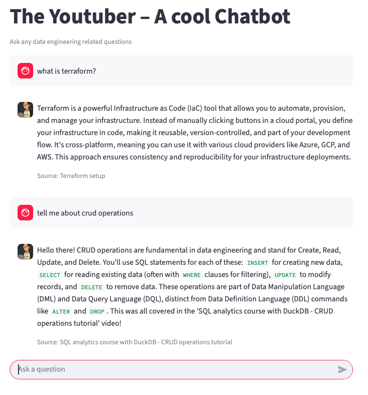

# RAGbot - The Youtuber
This project is a Retrieval Augmented Generation (RAG) chatbot that allows users to ask questions about data engineering video tutorials.
The system retrieves relevant video transcripts from a vector database and generates grounded answers using a Large Language Model.

The project is built as part of a lab assignment and demonstrates ingestion, vector search, API deployment and a simple frontend.

## Demo




## Features

* Ask natural language questions about YouTube-style tutorials
* Retrieval-Augmented Generation (RAG) pipeline
* Vector search using LanceDB
* Deployed backend using Azure Functions
* Simple and clean Streamlit UI

## Tech Stack

* PydanticAI – AI agent & structured outputs
* Azure Functions – serverless backend
* FastAPI – API framework (lokalt)
* Streamlit – frontend UI
* LanceDB – vector database
* Google Gemini – LLM & embeddings
* Python – programming language
* uv – package manager

## Architecture Overview
```
User (Streamlit UI)
        ↓
Azure Function (FastAPI /rag/query)
        ↓
Vector Search (LanceDB)
        ↓
LLM (via PydanticAI)
        ↓
Answer returned to UI
```

**Explanation**

* The user enters a question in the Streamlit frontend
* The request is sent to an Azure Function exposing a FastAPI endpoint
* Relevant transcript chunks are retrieved from LanceDB using vector similarity
* The LLM generates an answer based on retrieved context
* The answer is returned and displayed in the UI


## Prerequisites 

* Python 3.12+
* uv packages
* Google Gemini API key
* Azure Function key


## Installation

1. **Clone repository**
```bash
git clone https://github.com/ebt35/Rag_lab_eyoub_beraki_de24.git
```
2. **Install dependencies**
```
uv sync
```
3. **Set environment variables**
   
    Create a ```.env``` file:
```bash
GOOGLE_API_KEY=your_google_api_key
FUNCTION_APP_API=your_azure_function_api_key
```
4. Ingest Data
```bash
uv run python ingestion.py
```
This step will:
* Create LanceDB vector database
* Generate embeddings using Google Gemini embedding model
* Ingest and store all video transcript documents

## Running the Application
There are two ways to run the application:

Using the **deployed Azure Function API** or **locally with fastAPI**

**Option 1: Use the deployed Azure Functions API** 

This option uses the live, deployed backend.
```bash
uv run streamlit run frontend/app.py
```
* The Streamlit UI will open automatically at: http://localhost:8501
* The frontend connects directly to the deployed Azure Functions API
* No local backend setup is required
  
**Option 2: Local development with FastAPI**

Use this option if you want to run and test everything locally.
1. **Run the FastAPI backend**
   ```bash
   uv run uvicorn api:app --reload
   ```
* The API will be available at: http://127.0.0.1:8000

2. **Update the frontend to use a local API**

   In ```frontend/app.py```, change the API URL to:

    ```python
    URL = "http://127.0.0.1:8000/rag/query"
    ```

3. **Start the Streamlit frontend**
   ```uv run streamlit run frontend/app.py```
* Open the UI at: http://localhost:8501

## Deployment

The backend API is deployed using **Azure Functions.**

**Live API endpoint**
```
https://ragbot-ebt.azurewebsites.net/rag/query
```

The API accepts **POST requests only** and is accessed using an Azure Function key.

The Streamlit frontend communicates with the deployed backend via this endpoint.


## Project Structure

```
RAG_LAB_EYOUB_BERAKI_DE24/
├── assets/                  
├── backend/                 # Rag-agent datamodels
├── data/                    # Transcripts in markdown
├── frontend/
│   └── app.py               # Streamlit frontend application
├── knowledge_base/          # Source documents (Markdown files)
├── Explorations/
│   ├── __init__.py
│   └── explorations.ipynb   # Experiments and testing notebooks
├── api.py                   # FastAPI / RAG API logic
├── function_app.py          # Azure Function entry point (HTTP trigger)
├── ingestion.py             # Data ingestion and embedding pipeline
├── host.json                # Azure Functions host configuration
├── requirements.txt         # Python dependencies
├── pyproject.toml           # Project metadata and tooling config
├── uv.lock                  # Dependency lock file
├── .env                     # Environment variables (not committed)
├── local.settings.json      # Local Azure Functions settings
├── .funcignore              # Files ignored during Azure deployment
├── .gitignore               
├── .python-version         
├── README.md                
├── .vscode/                  
├── .venv/                                                      
├── __pycache__/             
└── .python_packages/          
```